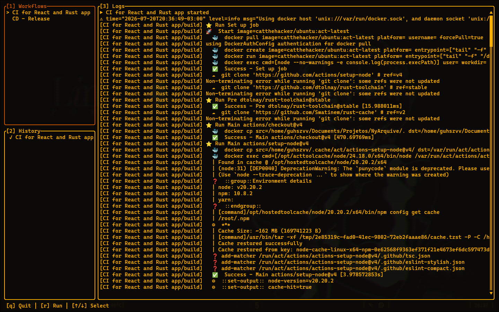

# lazyact

> TUI tool to list and run GitHub Actions workflows locally.

<p align="center">
  
</p>

## Features

- Lists workflows from `.github/workflows/`
- Runs workflows via `act` directly from the TUI
- 3 panels: Workflows, History, Logs
- Keyboard navigation, scroll, loading spinner

## Quick start

```sh
cargo run
```

**Prerequisite:** `act` CLI installed and on `$PATH`.

## Keybindings

| Key | Action |
|-----|--------|
| `q` | Quit |
| `r` | Run selected workflow |
| `1`/`2`/`3` | Focus Workflows / History / Logs |
| `↑`/`↓` | Navigate workflows / scroll logs |
| `PgUp`/`PgDn` | Scroll page up/down |
| `Home`/`End` | Scroll to top/bottom |

Mouse scroll works when Logs panel is focused.

## Architecture

3 independent panels + async event channel (tokio mpsc). Workflow execution spawns an `act` subprocess, streaming stdout/stderr as events.

## Dependencies

Rust edition 2024, ratatui, tokio, serde_yaml, rattles.
